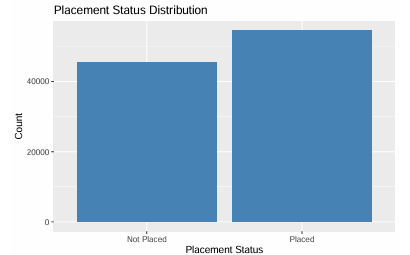

# Student Placement Prediction using Support Vector Machines

## Overview

This project explores the use of **Support Vector Machines (SVMs)** to predict student placement outcomes based on academic, demographic, and extracurricular characteristics.

Both **linear** and **nonlinear (RBF kernel)** SVM models are implemented and compared. Additionally, **Principal Component Analysis (PCA)** is used to visualize the structure of the data and assess class separability.

The complete analysis, methodology, and results can be found in **SVM_report.pdf**.

---

## Dataset

This project uses the **Student Placement Prediction Dataset 2026** from Kaggle:

https://www.kaggle.com/datasets/sehaj1104/student-placement-prediction-dataset-2026/data

The dataset contains information related to:

- Academic performance
- Technical skills
- Communication skills
- Internship experience
- Extracurricular activities
- College tier
- Student demographics

### Target Variable

- `placement_status`
  - Placed
  - Not Placed

### Data Cleaning

The following variables were removed before modeling:

| Variable | Reason |
|-----------|----------|
| `student_id` | Identifier with no predictive value |
| `salary_package_lpa` | Causes data leakage because salary information is only available after placement |

---

## Repository Structure

```text
.
├── Code/
│   └── SVM_code.R
│
├── data/
│   └── student_placement_prediction_dataset_2026.csv
│
├── figures/
│   ├── Data_PCA_plot.png
│   ├── Placement_status_distribution.png
│   └── SVM_PCA_plot.png
│
├── LICENSE
├── README.md
└── SVM_report.pdf
```

---

## Methodology

### Data Preprocessing

- Removal of non-informative and leakage variables
- One-hot encoding of categorical variables
- 80/20 train-test split
- Feature standardization using training-set statistics

### Exploratory Data Analysis

- Placement status distribution
- Correlation analysis
- Principal Component Analysis (PCA)

### Models

#### Linear Soft-Margin SVM

A linear Support Vector Machine trained using the **LiblineaR** package.

#### Nonlinear SVM (RBF Kernel)

A Support Vector Machine using the Radial Basis Function (RBF) kernel with hyperparameter tuning via 5-fold cross-validation.

Hyperparameter grid:

- Cost (C): {0.1, 1, 10}
- Gamma (σ): {0.01, 0.1, 1}

---

## Results

### Placement Status Distribution



### PCA Visualization of the Dataset


The PCA projections reveal substantial overlap between the classes, indicating limited separability in low-dimensional space.

### SVM Predictions in PCA Space


Both the linear and RBF SVM models show similar behavior, reflecting the difficulty of separating the classes using the available features.

---

## Performance Summary

| Metric | Linear SVM | RBF SVM |
|----------|------------|---------|
| Accuracy | 57.6% | 55.2% |
| Balanced Accuracy | 55.5% | 52.5% |
| Recall (Not Placed) | 33.1% | 22.5% |
| Recall (Placed) | 77.9% | 82.4% |
| F1-score (Not Placed) | 0.41 | 0.31 |
| F1-score (Placed) | 0.67 | 0.67 |

---

## Conclusions

The results indicate that:

- Both models achieve only modest predictive performance.
- A large proportion of observations become support vectors, indicating substantial class overlap.
- The RBF kernel does not significantly improve performance over the linear model.
- The primary limitation appears to be the lack of strong class separation in the available features rather than the choice of model.

Potential future improvements include:

- Feature engineering
- Class balancing techniques
- Alternative machine learning algorithms
- Additional data collection

---

## Requirements

Main R packages used:

```r
library(LiblineaR)
library(e1071)
library(kernlab)
library(caret)
library(ggplot2)
library(ggcorrplot)
library(skimr)
library(patchwork)
library(doParallel)
```

Install all required packages:

```r
install.packages(c(
  "LiblineaR",
  "e1071",
  "kernlab",
  "caret",
  "ggplot2",
  "ggcorrplot",
  "skimr",
  "patchwork",
  "doParallel"
))
```

---

## Running the Project

1. Clone the repository:

```bash
git clone https://github.com/Mateus-Auza/student-placement-prediction-svm.git
```

2. Open `Code/SVM_code.R` in RStudio.

3. Ensure the dataset is located in the `data/` directory.

4. Run the script to reproduce the analysis and figures.

---

## Author

**Mateus Auza Cruz**

Completed: May 2026

---
